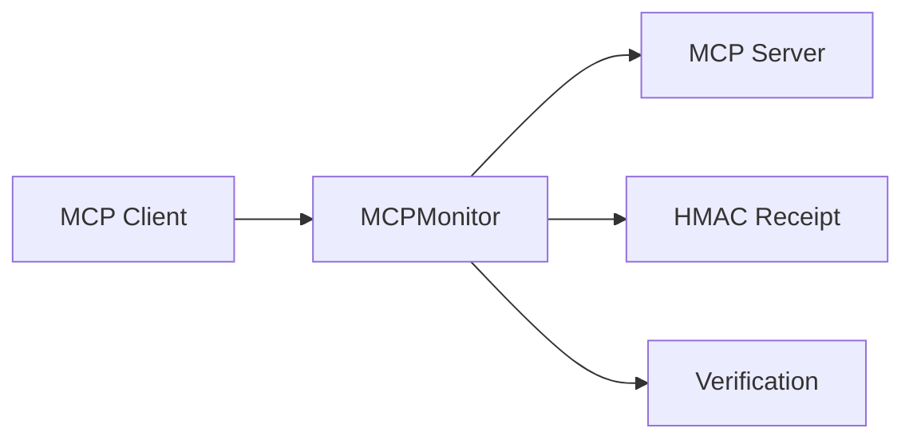

# MCP Adapter

Monitor tool calls in Model Context Protocol (MCP) servers by intercepting `tools/call` JSON-RPC messages.

## Install

```bash
pip install toolwitness[mcp]
```

## Usage

```python
from toolwitness.adapters.mcp import MCPMonitor
from toolwitness.storage.sqlite import SQLiteStorage

monitor = MCPMonitor(storage=SQLiteStorage())

# When a tool call comes in
monitor.on_tool_call(params={
    "name": "get_weather",
    "arguments": {"city": "Miami"},
})

# When the tool returns
monitor.on_tool_result(
    tool_name="get_weather",
    result={"temp_f": 72, "condition": "sunny"},
)

# Verify the agent's response
results = monitor.verify("Miami is 72°F and sunny.")
```

## JSON-RPC integration

For direct integration with MCP's JSON-RPC transport:

```python
monitor = MCPMonitor(storage=SQLiteStorage())

# Process raw JSON-RPC messages
monitor.on_jsonrpc_message({
    "jsonrpc": "2.0",
    "method": "tools/call",
    "params": {
        "name": "get_weather",
        "arguments": {"city": "Miami"},
    },
    "id": 1,
})
```

The `on_jsonrpc_message` method automatically:

- Detects `tools/call` requests and records them
- Correlates responses by JSON-RPC `id`
- Generates HMAC-signed receipts for each tool execution

## Options

| Parameter | Type | Default | Description |
|---|---|---|---|
| `storage` | `SQLiteStorage` | `None` | Persist results for CLI and dashboard |
| `session_id` | `str` | auto-generated | Custom session identifier |

## Architecture



ToolWitness sits as a transparent proxy between the MCP client and server, recording tool calls and results without modifying the protocol flow.

## Next

- [Getting Started](../getting-started.md) — basic usage and CLI
- [How It Works](../how-it-works.md) — verification engine details
