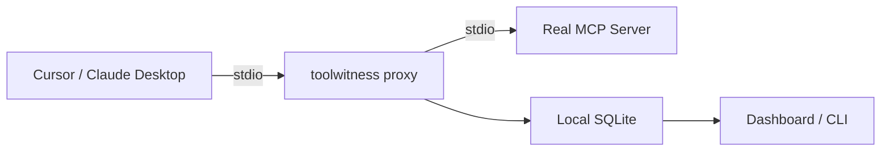

# Getting Started

## Install

```bash
pip install toolwitness
```

With framework adapters:

=== "OpenAI"
    ```bash
    pip install toolwitness[openai]
    ```

=== "Anthropic"
    ```bash
    pip install toolwitness[anthropic]
    ```

=== "LangChain"
    ```bash
    pip install toolwitness[langchain]
    ```

=== "MCP"
    ```bash
    pip install toolwitness[mcp]
    ```

=== "CrewAI"
    ```bash
    pip install toolwitness[crewai]
    ```

=== "All adapters"
    ```bash
    pip install toolwitness[all]
    ```

---

## Basic Usage (3 Lines)

```python
from toolwitness import ToolWitnessDetector
from toolwitness.storage.sqlite import SQLiteStorage

# Create detector with SQLite persistence
detector = ToolWitnessDetector(storage=SQLiteStorage())

# Register a tool
@detector.tool()
def get_weather(city: str) -> dict:
    return {"city": city, "temp_f": 72, "condition": "sunny"}

# Execute and verify
result = detector.execute_sync("get_weather", {"city": "Miami"})
verification = detector.verify_sync("The weather in Miami is 72°F and sunny.")
print(verification)
# [VerificationResult(tool_name='get_weather', classification=VERIFIED, confidence=0.95)]
```

That's it. The tool call is recorded with a cryptographic receipt, the agent's response is compared against the actual output, and you get a classification with a confidence score.

---

## Per-Adapter Quick Start

??? example "OpenAI"

    ```python
    from openai import OpenAI
    from toolwitness.adapters.openai import wrap
    from toolwitness.storage.sqlite import SQLiteStorage

    client = wrap(OpenAI(), storage=SQLiteStorage())
    # wrap() attaches a .toolwitness monitor to your client.
    # Use client.toolwitness.extract_tool_calls(), execute_tool_calls(),
    # and verify() in your agent loop to monitor tool faithfulness.
    ```

    See [OpenAI adapter docs →](adapters/openai.md)

??? example "Anthropic"

    ```python
    from anthropic import Anthropic
    from toolwitness.adapters.anthropic import wrap
    from toolwitness.storage.sqlite import SQLiteStorage

    client = wrap(Anthropic(), storage=SQLiteStorage())
    ```

    See [Anthropic adapter docs →](adapters/anthropic.md)

??? example "LangChain"

    ```python
    from toolwitness.adapters.langchain import ToolWitnessMiddleware
    from toolwitness.storage.sqlite import SQLiteStorage

    middleware = ToolWitnessMiddleware(
        on_fabrication="raise",  # or "log" or "callback"
        storage=SQLiteStorage(),
    )
    # Add middleware as a callback to your LangChain agent
    ```

    See [LangChain adapter docs →](adapters/langchain.md)

??? example "MCP (Model Context Protocol)"

    ```python
    from toolwitness.adapters.mcp import MCPMonitor

    monitor = MCPMonitor()
    monitor.on_tool_call(params={
        "name": "get_weather",
        "arguments": {"city": "Miami"},
    })
    monitor.on_tool_result(tool_name="get_weather", result={"temp_f": 72})
    results = monitor.verify("Miami is 72°F.")
    ```

    See [MCP adapter docs →](adapters/mcp.md)

??? example "CrewAI"

    ```python
    from toolwitness.adapters.crewai import monitored_tool

    @monitored_tool
    def get_weather(city: str) -> str:
        return '{"city": "Miami", "temp_f": 72}'

    output = get_weather(city="Miami")
    results = get_weather.toolwitness.verify("Miami is 72°F.")
    ```

    See [CrewAI adapter docs →](adapters/crewai.md)

---

## CLI

After running your agent with ToolWitness, inspect results from the command line:

```bash
toolwitness check --last 5                         # Recent results
toolwitness stats                                  # Per-tool failure rates
toolwitness watch                                  # Live tail
toolwitness report --format html                   # HTML report
toolwitness dashboard                              # Local web dashboard (standalone)
```

!!! info "The dashboard starts automatically"
    When `toolwitness serve` is running as an MCP server (see [MCP Proxy](#mcp-proxy) below), the dashboard is **automatically available** at **http://localhost:8321** — no extra terminal needed. It starts as a background thread inside the MCP server process and stops when Cursor closes. Works on macOS, Windows, and Linux.

    The standalone `toolwitness dashboard` command is still available if you want to run it separately (e.g. without the MCP server).

See [CLI Reference →](cli.md) for all commands and options.

---

## CI Gate

Add ToolWitness to your CI pipeline to fail builds when agents misbehave:

```bash
toolwitness check --fail-if "failure_rate > 0.05"
toolwitness check --fail-if "fabricated_count > 0"
```

Exit code 1 when the condition is met — drop it into any CI system.

---

## Configuration

Generate a config file with commented defaults:

```bash
toolwitness init
```

This creates `toolwitness.yaml`. Config precedence:

1. Environment variables (`TOOLWITNESS_*`) — highest priority
2. YAML file (`toolwitness.yaml`)
3. Code defaults — lowest priority

---

## Multi-Agent Quick Start

If you're running multiple agents that pass data to each other, ToolWitness can track handoffs and catch cross-agent fabrication:

```python
from toolwitness import ToolWitnessDetector
from toolwitness.storage.sqlite import SQLiteStorage

storage = SQLiteStorage()

orchestrator = ToolWitnessDetector(
    storage=storage, agent_name="orchestrator",
)
researcher = ToolWitnessDetector(
    storage=storage,
    agent_name="researcher",
    parent_session_id=orchestrator.session_id,
)

# After orchestrator calls tools, record the handoff
orchestrator.register_handoff(researcher, data="customer record")

# Verify the researcher's response against original tool outputs
local, handoff_results = researcher.verify_with_handoffs(
    "Customer is John Smith..."
)
```

See the full guide at [Multi-Agent Support →](multi-agent.md).

---

## MCP Proxy

If you use **Cursor**, **Claude Desktop**, or any MCP-compatible host, you can monitor tool calls with zero code changes. The `toolwitness proxy` command wraps any MCP server transparently.

### Setup

**Step 1: Find your toolwitness path**

MCP hosts like Cursor don't inherit your shell's `PATH`, so you need the full path to the `toolwitness` binary:

```bash
which toolwitness
# Example output: /opt/anaconda3/bin/toolwitness
```

**Step 2: Add to your MCP config**

!!! tip "Use the global config"
    For **Cursor**, add the server to the **global** config at **`~/.cursor/mcp.json`** (not the project-level `.cursor/mcp.json`). Project-level configs may not load reliably in all Cursor versions.

=== "Cursor (~/.cursor/mcp.json)"

    ```json
    {
      "mcpServers": {
        "my-server": {
          "command": "/full/path/to/toolwitness",
          "args": ["proxy", "--", "npx", "-y", "@modelcontextprotocol/server-filesystem", "/path/to/folder"]
        }
      }
    }
    ```

=== "Claude Desktop"

    ```json
    {
      "mcpServers": {
        "my-server": {
          "command": "/full/path/to/toolwitness",
          "args": ["proxy", "--", "npx", "-y", "@modelcontextprotocol/server-filesystem", "/path/to/folder"]
        }
      }
    }
    ```

Replace `/full/path/to/toolwitness` with the output from `which toolwitness`.

**Step 3: Reload your MCP host**

In Cursor: **Cmd+Shift+P** → "Developer: Reload Window". Every tool call through that server is now recorded with cryptographic receipts.

### View results

```bash
toolwitness executions --last 10  # Recent proxy tool calls with receipts
toolwitness dashboard             # Local web dashboard at localhost:8321
```

!!! note "Executions vs verifications"
    The proxy records **executions** (what tools were called and what they returned). Use `toolwitness executions` to see these. The `toolwitness check` command shows **verifications** (classifications like VERIFIED/FABRICATED) which require the SDK path where the agent's response text is available for comparison.

### How it works

The proxy sits between the MCP host and the real server, forwarding all JSON-RPC messages without modification. On every `tools/call` request and response, it records the interaction via the same verification engine used by the SDK adapters.



### Options

```bash
toolwitness proxy --db /path/to/custom.db -- npx your-server
toolwitness proxy --session-id my-session -- python my_server.py
```

### Close the Loop — Verification Bridge

The proxy records what tools return, but it can't see what the agent tells you. To detect fabrication, you need the **verification bridge** — it compares the agent's response text against proxy-recorded tool outputs.

**Option A: Real-time self-verification (recommended)**

Add `toolwitness serve` as a second MCP server in your config:

```json
{
  "mcpServers": {
    "my-server": {
      "command": "/full/path/to/toolwitness",
      "args": ["proxy", "--", "npx", "your-server"]
    },
    "toolwitness": {
      "command": "/full/path/to/toolwitness",
      "args": ["serve"]
    }
  }
}
```

This also starts the **dashboard automatically** at [http://localhost:8321](http://localhost:8321) — no extra terminal needed.

**Step 3: Enable automatic verification**

Run this once in your project directory:

```bash
toolwitness init --cursor-rule
```

This creates `.cursor/rules/toolwitness-verify.mdc`, which tells the agent to call `tw_verify_response` after using monitored tools. Without this rule, the proxy records tool calls but the dashboard won't show trust classifications (VERIFIED/FABRICATED).

Verification results appear in the conversation and on the dashboard, tagged with a "Bridge" badge.

**Option B: CLI spot-check**

After seeing an agent response you want to verify:

```bash
toolwitness verify --text "The file is 6169 bytes, modified on March 27"
```

The bridge handles real-world MCP output — long file contents, key-value text formats, agent summaries that paraphrase rather than echo. [How text grounding works →](how-it-works.md#text-grounding-long-outputs)

All verification happens locally. Response text is stored in your local SQLite database, never transmitted. [Privacy details →](privacy.md#verification-bridge-privacy)

---

## Notifications

Once you have verifications flowing (from the SDK or the bridge), you can set up passive monitoring so you don't have to watch the dashboard constantly.

### Quick setup

**Step 1:** Add alerting config to `toolwitness.yaml`:

```yaml
alerting:
  slack_webhook_url: https://hooks.slack.com/services/...

  threshold_rules:
    - name: failure_accumulation
      max_failures: 10
      window_minutes: 60
```

Threshold alerts fire automatically when the bridge or SDK detects failures that breach your limit.

**Step 2:** Preview the daily digest:

```bash
toolwitness digest --period 24h
```

**Step 3:** Schedule delivery via cron:

```bash
0 18 * * * /path/to/toolwitness digest --send --period 24h
```

Alerts send classification metadata only — tool name, confidence, classification. No code, no file contents, no prompts leave your machine. [Full alerting model →](alerting-model.md) | [Privacy details →](privacy.md#alert-privacy)

---

## Troubleshooting

### "I see 0 executions"

The most common first-run issue. The verification server returns empty results because the proxy isn't recording tool calls.

**Quick diagnosis:**

```bash
toolwitness doctor
```

This checks every prerequisite — Python version, binary path, database, Node/npx, MCP config — and tells you exactly what to fix.

If you're inside Cursor, you can also call the `tw_health` MCP tool directly. It checks database connectivity and proxy activity, and returns a plain-English diagnosis.

**Common causes:**

| Symptom | Cause | Fix |
|---------|-------|-----|
| `tw_health` says "0 recorded executions" | Proxy never started successfully | Restart `filesystem-monitored` in Cursor Settings > MCP |
| `toolwitness doctor` warns about duplicate configs | Same server defined in both global and project MCP config | Remove the duplicate from `.cursor/mcp.json` (keep global) |
| `npx not found` | Node.js not installed | `brew install node` (macOS) or install from [nodejs.org](https://nodejs.org) |
| `MCP SDK not installed` | Missing dependency for `toolwitness serve` | `pip install 'toolwitness[mcp]'` |
| Proxy starts but Cursor shows error | Path to `toolwitness` binary is wrong in MCP config | Run `which toolwitness` and update the `command` field |

### End-to-end verification test

To confirm the full pipeline works:

1. Make sure both MCP servers show green in Cursor Settings > MCP
2. Use a monitored tool (e.g. read a file through the filesystem server)
3. Call `tw_recent_executions` — you should see the tool call listed
4. Call `tw_verify_response` with your response text — you should see a classification

If step 3 returns 0 executions, the proxy isn't recording. Run `toolwitness doctor` for detailed diagnostics.

### Restarting MCP servers in Cursor

**Cmd+Shift+P** → "Developer: Reload Window" restarts all MCP servers. You can also toggle individual servers off and on in Cursor Settings > MCP.

---

## What's Next

- [How It Works](how-it-works.md) — understand the verification engine
- [Multi-Agent Support](multi-agent.md) — monitor agent chains and swarms
- [Privacy & Security](privacy.md) — what ToolWitness sees and doesn't see
- [Adapter docs](adapters/openai.md) — detailed per-framework guides
