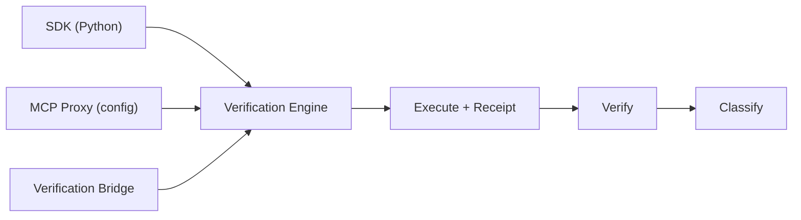
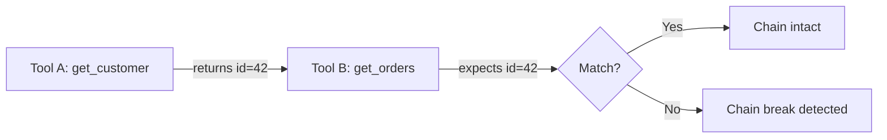
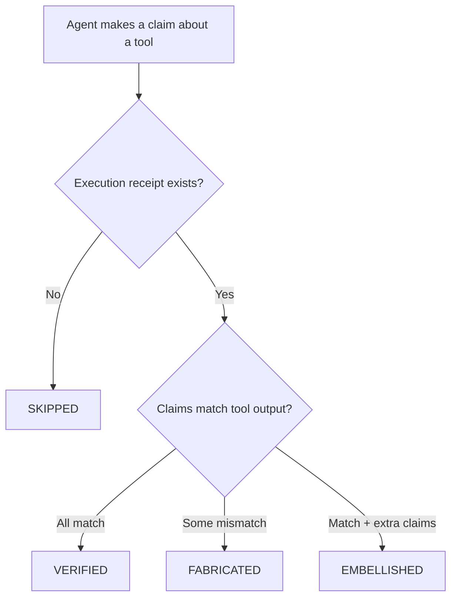
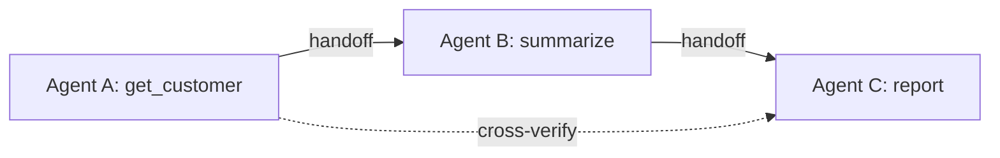

# How It Works

ToolWitness verifies agent truthfulness through a four-step pipeline. The same verification engine powers all three integration paths — the SDK for developers, the MCP Proxy for recording tool calls, and the Verification Bridge for closing the loop in MCP hosts.



---

## Step 1: Connect

=== "SDK — for developers building agents"

    Add ToolWitness to your agent with a few lines of code. Register your tools with the detector, or use `wrap()` to attach a monitor to your OpenAI/Anthropic client. Then use ToolWitness helpers in your agent loop to execute and verify tool calls.

    ```python
    from toolwitness import ToolWitnessDetector

    detector = ToolWitnessDetector()

    @detector.tool()
    def get_weather(city: str) -> dict:
        return {"city": city, "temp_f": 72}
    ```

    Works with five frameworks: [OpenAI](adapters/openai.md), [Anthropic](adapters/anthropic.md), [LangChain](adapters/langchain.md), [MCP](adapters/mcp.md), and [CrewAI](adapters/crewai.md).

=== "MCP Proxy — for Cursor, Claude Desktop, and other MCP tools"

    One config change wraps any MCP server with ToolWitness monitoring. Zero code, zero changes to your agent or server.

    ```json
    {
      "mcpServers": {
        "my-server": {
          "command": "toolwitness",
          "args": ["proxy", "--", "npx", "-y", "your-server"]
        }
      }
    }
    ```

    The proxy sits between the MCP host and the real server, forwarding all messages and recording tool calls transparently. See [Getting Started > MCP Proxy](getting-started.md#mcp-proxy) for full setup.

---

## Step 2: Execute (Cryptographic Receipts)

!!! note "Same engine for SDK and MCP Proxy"
    Steps 2–4 are identical regardless of how you connected ToolWitness. Whether you registered tools in Python or wrapped an MCP server with the proxy, every tool call gets the same HMAC receipts, structural matching, and classification.

When a tool runs, ToolWitness generates an **HMAC-signed execution receipt**:

- The receipt contains: tool name, arguments, return value, timestamp, and a cryptographic signature
- The signing key lives in ToolWitness, not in the model's context
- The model **cannot forge a receipt** — if it claims a tool ran, ToolWitness can verify whether that's true

This is what separates ToolWitness from logging. A log says "this tool was called." A receipt proves it — cryptographically.

---

## Step 3: Verify

After the agent responds, ToolWitness compares the agent's claims against actual tool outputs using three verification methods:

### Structural matching

Compares specific values in the agent's text against the tool's return data. If the tool returned `{"temp_f": 72}` and the agent says "85°F", that's a mismatch.

### Schema conformance

Checks whether the agent's claims are consistent with the structure of the tool output. If the tool returns temperature data and the agent claims to know humidity, that's an extra claim beyond what the tool provided.

### Text grounding (long outputs)

Real MCP tools don't always return clean JSON. `get_file_info` might return `"size: 6169\ncreated: 2026-03-28T10:15:00"` — a plain text string, not a structured dict. And `read_file` returns entire file contents that agents *summarize* rather than echo verbatim.

Standard structural matching fails here. Checking whether the agent's summary "contains" the source text doesn't work — summaries paraphrase. Checking whether the source contains the agent's claims doesn't work either — the agent's language is different from the source format.

ToolWitness handles this with two specialized strategies:

- **KV text parsing** — detects `key: value` text patterns in tool output and restructures them into comparable dictionaries. `"size: 6169\ncreated: 2026-03-28"` becomes `{"size": "6169", "created": "2026-03-28"}`, enabling standard structural matching.

- **Text grounding** — for truly long outputs (file contents, documentation), reverses the comparison direction. Instead of "does the source contain the agent's text?", it asks "are the agent's *claims* supported by the *source*?" It extracts quoted phrases, dates, numbers, acronyms, and distinctive words from the agent's response, then checks each claim against the source material. An agent that accurately summarizes a file scores high; an agent that invents a date that doesn't appear in the source gets flagged.

This matters because without text grounding, fabrication detection would only work for short, structured outputs — exactly the ones that are already easy to verify manually. The hard cases — summarized file contents, paraphrased documentation, reformatted data — are where agents are most likely to fabricate and where grounding catches them.

### Chain verification (multi-turn)

For sequences of tool calls, ToolWitness checks data flow between steps. If Tool A returns a customer ID and Tool B is supposed to look up that customer, ToolWitness verifies that Tool B's input actually matches Tool A's output.



---

## Why Fabrication Happens: Context Rot

Understanding *what* ToolWitness detects is important. Understanding *why* these failures occur helps you prevent them.

The primary driver of fabrication in multi-tool sessions is **context rot** — the degradation of LLM accuracy as the context window fills. Three mechanisms contribute:

1. **Attention dilution** — transformer attention spreads thinner as token count grows, reducing the model's ability to focus on any single tool output
2. **Positional bias** — models attend more to tokens at the start and end of context; tool outputs in the middle get less attention (the ["lost in the middle" effect](https://arxiv.org/abs/2307.03172))
3. **Noise scaling** — each additional tool call adds redundancy and loose associations that compound faster than useful signal

The result: after several tool calls, the agent can *see* earlier tool outputs in its context but can't reliably *use* them. It fills gaps from training knowledge or confuses data across calls — producing fabrications that look plausible but contradict what the tools actually returned.

Context rot is silent. No errors, no crashes — just gradually less faithful responses. This is precisely why ToolWitness exists: to catch what the agent itself cannot detect.

For mitigation strategies and fixes, see the [Remediation Guide](remediation.md#understanding-context-rot).

---

## Step 4: Classify

Each tool interaction receives one of five classifications with a confidence score (0.0 to 1.0):

| Classification | Meaning | Confidence indicates |
|---|---|---|
| **VERIFIED** | Agent accurately reported what the tool returned | How closely the response matches tool output |
| **EMBELLISHED** | Agent reported tool output but added extra claims | How much of the response goes beyond tool data |
| **FABRICATED** | Agent's claims contradict what the tool returned | How clearly the values differ |
| **SKIPPED** | Agent claimed a tool ran but no receipt exists | Binary — receipt exists or it doesn't |
| **UNMONITORED** | Tool wasn't wrapped by ToolWitness | N/A — outside monitoring scope |

### Classification flow



---

## Alerting

When ToolWitness detects failures, you can alert on them using the built-in alerting engine.

- **Webhook** — POST to any URL
- **Slack** — formatted messages with classification badges
- **Callback** — call your own Python function
- **Log** — structured log entries (default)

### Recommended: Auto-alerting (set once, fires every time)

Pass an `AlertEngine` to the detector and alerts fire automatically after every `verify()` call — no extra code in your agent loop:

```python
from toolwitness import ToolWitnessDetector
from toolwitness.storage.sqlite import SQLiteStorage
from toolwitness.alerting.rules import AlertEngine, AlertRule
from toolwitness.alerting.channels import SlackChannel
from toolwitness.core.types import Classification

engine = AlertEngine()
engine.add_rule(AlertRule(
    classifications={Classification.FABRICATED, Classification.SKIPPED},
    min_confidence=0.8,
    channels=[SlackChannel("https://hooks.slack.com/services/...")],
))

detector = ToolWitnessDetector(
    storage=SQLiteStorage(),
    alert_engine=engine,
)

# From this point on, every verify() call automatically sends alerts
# when fabrication or skips are detected. No extra code needed.
results = detector.verify_sync("The weather is 85°F.")
```

### Alternative: Manual wiring

If you need full control over when alerts are processed, create the engine separately and call `process()` yourself:

```python
results = detector.verify_sync("The weather is 85°F.")
engine.process(results, session_id=detector.session_id)
```

### MCP Proxy users — the Verification Bridge

The proxy records tool calls (Conversation 1) but doesn't see the agent's text response (Conversation 2). The **Verification Bridge** closes this gap with two options:

**Option A: Real-time self-verification** — Run `toolwitness serve` as a second MCP server. The agent calls `tw_verify_response` with its response text, and ToolWitness compares it against recent proxy recordings. Pair with a Cursor rule for automatic verification.

```json
{
  "mcpServers": {
    "toolwitness": {
      "command": "/full/path/to/toolwitness",
      "args": ["serve"]
    }
  }
}
```

**Option B: CLI spot-check** — After seeing an agent response, verify it manually:

```bash
toolwitness verify --text "The file is 6169 bytes, modified March 27"
```

Both options use the same verification engine and store results in the same database, visible on the dashboard.

For CI-style alerting: `toolwitness check --fail-if "fabricated_count > 0"`

### YAML configuration

Configure alerting rules in `toolwitness.yaml`:

```yaml
alerting:
  slack_webhook_url: "https://hooks.slack.com/services/..."
  rules:
    - classifications: [fabricated, skipped]
      min_confidence: 0.8
  session_rules:
    - max_failure_rate: 0.15
      min_total: 3
```

Then build the engine from config:

```python
from toolwitness.alerting.rules import AlertEngine

engine = AlertEngine.from_config(config.alerting_config)
detector = ToolWitnessDetector(
    storage=SQLiteStorage(), alert_engine=engine,
)
```

---

## Dashboard and Reports

ToolWitness includes two built-in visualization tools:

### Local dashboard

```bash
toolwitness dashboard  # http://localhost:8321
```

This starts a local HTTP server on your machine (like TensorBoard or `mkdocs serve`). No cloud, no account — open `localhost:8321` in your browser and Ctrl+C to stop. Live-updating dashboard with KPI cards, classification breakdown, per-tool failure rates, and recent verifications. Auto-refreshes every 5 seconds. All data reads from local SQLite — nothing is transmitted. [Privacy details →](privacy.md)

### HTML report

```bash
toolwitness report --format html
```

Self-contained HTML file with session timelines, failure detail cards with evidence, remediation suggestions, and per-tool statistics. Share via email, attach to tickets, or screenshot for reports.

---

## Multi-Agent Verification

When multiple agents collaborate, fabrication can compound across handoffs. Agent A calls a tool and gets clean data; Agent B receives it and misrepresents it; Agent C builds a report on the wrong data. Every individual trace looks fine.

ToolWitness extends the verification model to multi-agent systems:

- **Session hierarchy** — agents declare their name and parent, forming a tree
- **Handoff tracking** — data transfers between agents are recorded with originating tool receipt IDs
- **Cross-agent verification** — the receiving agent's claims are checked against the *original* tool output, not just what was passed to it



See the [Multi-Agent Support](multi-agent.md) page for the full model, code examples, and dashboard view.

---

## Alerting Model

ToolWitness provides three tiers of notification for different user needs.

### Per-result alerts

Individual verification rules fire on each result. Configure classifications and minimum confidence:

```yaml
alerting:
  slack_webhook_url: https://hooks.slack.com/services/...
  rules:
    - name: critical_fabrication
      classifications: [fabricated, skipped]
      min_confidence: 0.8
```

### Threshold alerts

Time-window rules check for failure accumulation across sessions. Two modes:

- **Count threshold** — alert when N or more failures occur within a sliding window
- **Rate threshold** — alert when failure rate exceeds X% with a minimum sample size

```yaml
alerting:
  threshold_rules:
    - name: failure_accumulation
      max_failures: 10
      window_minutes: 60
    - name: high_failure_rate
      max_failure_rate: 0.20
      min_verifications: 10
      window_minutes: 60
```

### Daily digest

Scheduled summary of verification activity. Run from cron or manually:

```bash
toolwitness digest --send --period 24h
```

Alerts send classification metadata only (tool name, confidence, classification) — never code, file contents, or prompts. [Privacy details →](privacy.md)

See [Alerting Model](alerting-model.md) for the full design including user personas and configuration examples.

---

## Next Steps

- [Getting Started](getting-started.md) — install and run your first verification
- [Multi-Agent Support](multi-agent.md) — monitor agent chains and swarms
- [Privacy & Security](privacy.md) — what ToolWitness sees and doesn't see
- [CLI Reference](cli.md) — all commands and options
- [Alerting Model](alerting-model.md) — notification tiers, user personas, and configuration
