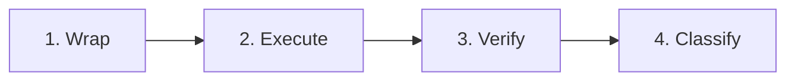
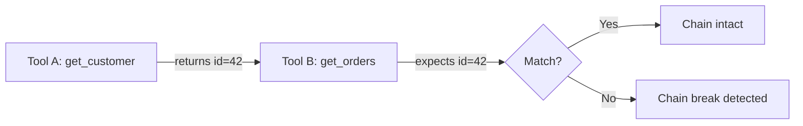
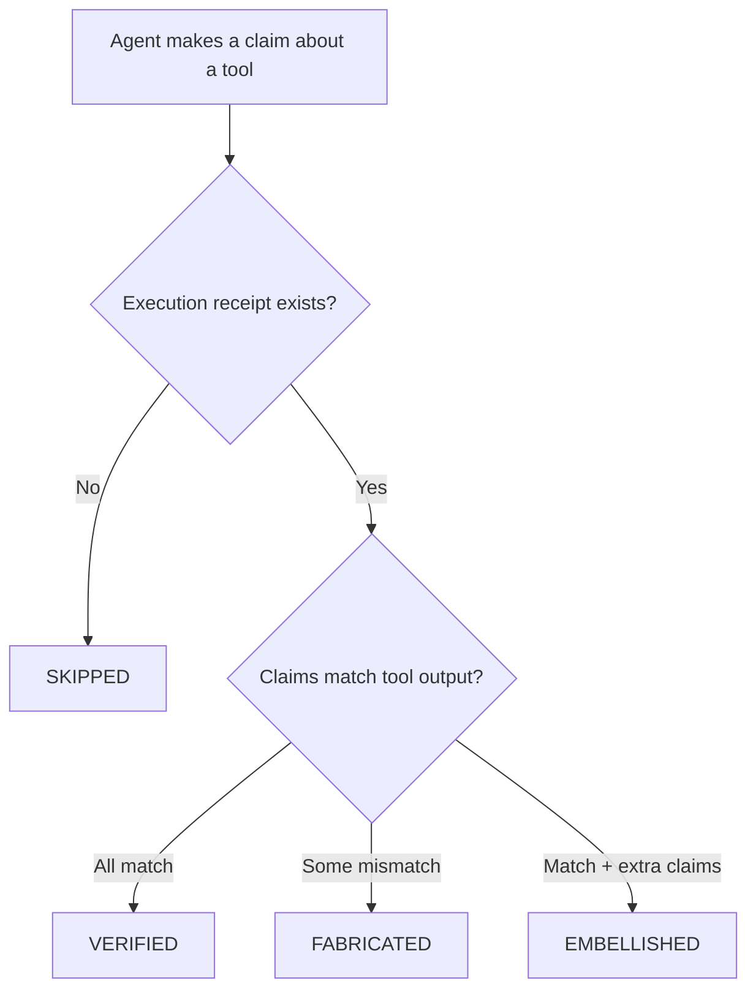
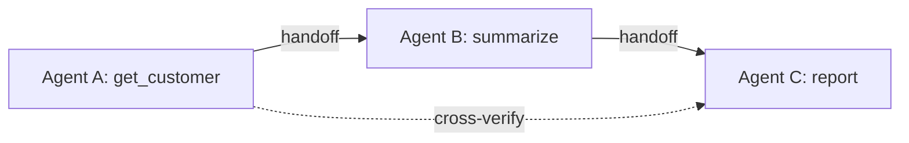

# How It Works

ToolWitness verifies agent truthfulness in four steps:



---

## Step 1: Wrap

Add ToolWitness to your agent with a few lines of code. Register your tools with the detector, or use `wrap()` to attach a monitor to your OpenAI/Anthropic client. Then use ToolWitness helpers in your agent loop to execute and verify tool calls.

```python
from toolwitness import ToolWitnessDetector

detector = ToolWitnessDetector()

@detector.tool()
def get_weather(city: str) -> dict:
    return {"city": city, "temp_f": 72}
```

Works with five frameworks: [OpenAI](adapters/openai.md), [Anthropic](adapters/anthropic.md), [LangChain](adapters/langchain.md), [MCP](adapters/mcp.md), and [CrewAI](adapters/crewai.md).

---

## Step 2: Execute (Cryptographic Receipts)

When a tool runs, ToolWitness generates an **HMAC-signed execution receipt**:

- The receipt contains: tool name, arguments, return value, timestamp, and a cryptographic signature
- The signing key lives in ToolWitness, not in the model's context
- The model **cannot forge a receipt** — if it claims a tool ran, ToolWitness can verify whether that's true

This is what separates ToolWitness from logging. A log says "this tool was called." A receipt proves it — cryptographically.

---

## Step 3: Verify

After the agent responds, ToolWitness compares the agent's claims against actual tool outputs using three verification methods:

### Structural matching

Compares specific values in the agent's text against the tool's return data. If the tool returned `{"temp_f": 72}` and the agent says "85°F", that's a mismatch.

### Schema conformance

Checks whether the agent's claims are consistent with the structure of the tool output. If the tool returns temperature data and the agent claims to know humidity, that's an extra claim beyond what the tool provided.

### Chain verification (multi-turn)

For sequences of tool calls, ToolWitness checks data flow between steps. If Tool A returns a customer ID and Tool B is supposed to look up that customer, ToolWitness verifies that Tool B's input actually matches Tool A's output.



---

## Step 4: Classify

Each tool interaction receives one of five classifications with a confidence score (0.0 to 1.0):

| Classification | Meaning | Confidence indicates |
|---|---|---|
| **VERIFIED** | Agent accurately reported what the tool returned | How closely the response matches tool output |
| **EMBELLISHED** | Agent reported tool output but added extra claims | How much of the response goes beyond tool data |
| **FABRICATED** | Agent's claims contradict what the tool returned | How clearly the values differ |
| **SKIPPED** | Agent claimed a tool ran but no receipt exists | Binary — receipt exists or it doesn't |
| **UNMONITORED** | Tool wasn't wrapped by ToolWitness | N/A — outside monitoring scope |

### Classification flow



---

## Alerting

When ToolWitness detects failures, you can alert on them using the built-in alerting engine.

- **Webhook** — POST to any URL
- **Slack** — formatted messages with classification badges
- **Callback** — call your own Python function
- **Log** — structured log entries (default)

### Recommended: Auto-alerting (set once, fires every time)

Pass an `AlertEngine` to the detector and alerts fire automatically after every `verify()` call — no extra code in your agent loop:

```python
from toolwitness import ToolWitnessDetector
from toolwitness.storage.sqlite import SQLiteStorage
from toolwitness.alerting.rules import AlertEngine, AlertRule
from toolwitness.alerting.channels import SlackChannel
from toolwitness.core.types import Classification

engine = AlertEngine()
engine.add_rule(AlertRule(
    classifications={Classification.FABRICATED, Classification.SKIPPED},
    min_confidence=0.8,
    channels=[SlackChannel("https://hooks.slack.com/services/...")],
))

detector = ToolWitnessDetector(
    storage=SQLiteStorage(),
    alert_engine=engine,
)

# From this point on, every verify() call automatically sends alerts
# when fabrication or skips are detected. No extra code needed.
results = detector.verify_sync("The weather is 85°F.")
```

### Alternative: Manual wiring

If you need full control over when alerts are processed, create the engine separately and call `process()` yourself:

```python
results = detector.verify_sync("The weather is 85°F.")
engine.process(results, session_id=detector.session_id)
```

### YAML configuration

Configure alerting rules in `toolwitness.yaml`:

```yaml
alerting:
  slack_webhook_url: "https://hooks.slack.com/services/..."
  rules:
    - classifications: [fabricated, skipped]
      min_confidence: 0.8
  session_rules:
    - max_failure_rate: 0.15
      min_total: 3
```

Then build the engine from config:

```python
from toolwitness.alerting.rules import AlertEngine

engine = AlertEngine.from_config(config.alerting_config)
detector = ToolWitnessDetector(
    storage=SQLiteStorage(), alert_engine=engine,
)
```

---

## Dashboard and Reports

ToolWitness includes two built-in visualization tools:

### Local dashboard

```bash
toolwitness dashboard  # http://localhost:8321
```

This starts a local HTTP server on your machine (like TensorBoard or `mkdocs serve`). No cloud, no account — open `localhost:8321` in your browser and Ctrl+C to stop. Live-updating dashboard with KPI cards, classification breakdown, per-tool failure rates, and recent verifications. Auto-refreshes every 5 seconds.

### HTML report

```bash
toolwitness report --format html
```

Self-contained HTML file with session timelines, failure detail cards with evidence, remediation suggestions, and per-tool statistics. Share via email, attach to tickets, or screenshot for reports.

---

## Multi-Agent Verification

When multiple agents collaborate, fabrication can compound across handoffs. Agent A calls a tool and gets clean data; Agent B receives it and misrepresents it; Agent C builds a report on the wrong data. Every individual trace looks fine.

ToolWitness extends the verification model to multi-agent systems:

- **Session hierarchy** — agents declare their name and parent, forming a tree
- **Handoff tracking** — data transfers between agents are recorded with originating tool receipt IDs
- **Cross-agent verification** — the receiving agent's claims are checked against the *original* tool output, not just what was passed to it



See the [Multi-Agent Support](multi-agent.md) page for the full model, code examples, and dashboard view.

---

## Next Steps

- [Getting Started](getting-started.md) — install and run your first verification
- [Multi-Agent Support](multi-agent.md) — monitor agent chains and swarms
- [Privacy & Security](privacy.md) — what ToolWitness sees and doesn't see
- [CLI Reference](cli.md) — all commands and options
