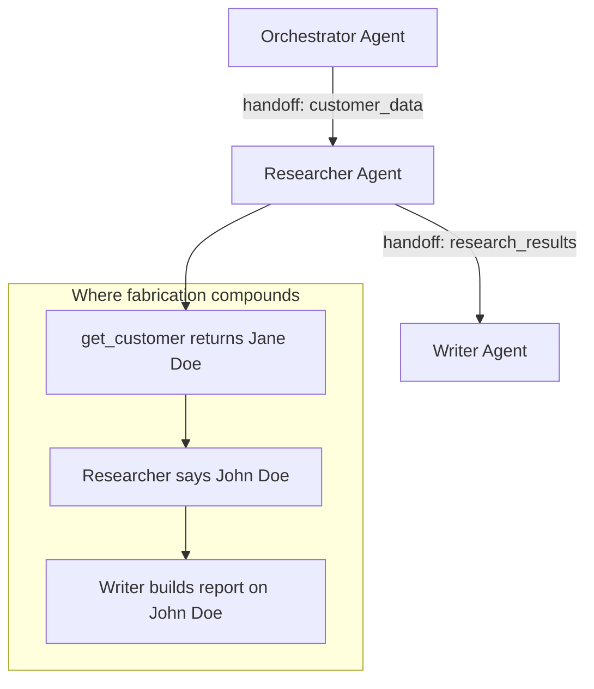

# Multi-Agent Support

ToolWitness monitors multi-agent systems — not just individual agents. When agents hand off data to each other, fabrication compounds: one corrupted value in Agent A becomes the foundation for Agent B's entire response. ToolWitness tracks these handoffs and catches corruption at the boundary.

---

## The problem: compounding fabrication

In a multi-agent system, each agent's trace can look clean in isolation. The orchestrator faithfully called `get_customer`. The researcher produced a summary. The writer generated a report. Every tool call succeeded. Every log looks normal.

But somewhere in the chain, a name changed from "Jane Doe" to "John Doe" — and every downstream agent built on the wrong data.



Existing observability tools see three clean traces. ToolWitness sees the data break.

---

## How it works

ToolWitness adds three capabilities for multi-agent systems:

### Session hierarchy

Every detector can declare its identity and its parent. This links agents into a tree that the dashboard renders visually.

```python
orchestrator = ToolWitnessDetector(
    storage=storage, agent_name="orchestrator",
)
researcher = ToolWitnessDetector(
    storage=storage,
    agent_name="researcher",
    parent_session_id=orchestrator.session_id,
)
writer = ToolWitnessDetector(
    storage=storage,
    agent_name="writer",
    parent_session_id=orchestrator.session_id,
)
```

### Handoff tracking

When an agent passes data to another agent, `register_handoff()` records what crossed the boundary and which tool receipts produced it.

```python
orchestrator.register_handoff(researcher, data="customer record")
```

This captures all current receipt IDs from the source agent, so cross-agent verification can later trace corruption back to the originating tool output.

### Cross-agent verification

`verify_with_handoffs()` does everything `verify_sync()` does, plus checks the receiving agent's response against the original tool output from the source agent.

```python
local_results, handoff_results = writer.verify_with_handoffs(
    "The customer John Doe placed 3 orders..."
)
```

If the writer says "John Doe" but the original `get_customer` tool returned "Jane Doe," ToolWitness produces a `HandoffVerificationResult` with a full corruption chain showing exactly where and how the data broke.

---

## Quick start

```python
from toolwitness import ToolWitnessDetector
from toolwitness.storage.sqlite import SQLiteStorage

storage = SQLiteStorage()

# Create the agent hierarchy
orchestrator = ToolWitnessDetector(
    storage=storage, agent_name="orchestrator",
)
researcher = ToolWitnessDetector(
    storage=storage,
    agent_name="researcher",
    parent_session_id=orchestrator.session_id,
)

# Orchestrator calls a tool
@orchestrator.tool()
def get_customer(name: str) -> dict:
    return {"name": name, "email": "jane@example.com", "id": 42}

orchestrator.execute_sync("get_customer", {"name": "Jane Doe"})

# Record the handoff to the researcher
orchestrator.register_handoff(researcher, data="customer record")

# Researcher produces a response — but corrupts the data
local, handoff_results = researcher.verify_with_handoffs(
    "The customer is John Smith with email john@other.com."
)

# handoff_results will contain a HandoffVerificationResult showing:
# - tool: get_customer
# - classification: FABRICATED
# - corruption_chain: original -> handoff -> receiving agent
for hr in handoff_results:
    print(f"Corruption detected: {hr.tool_name}")
    print(f"  Source session: {hr.source_session_id}")
    print(f"  Classification: {hr.classification.value}")
    for step in hr.corruption_chain:
        print(f"  Chain: {step['step']}")
```

---

## Dashboard view

The dashboard at `localhost:8321` shows multi-agent systems with:

- **Agent tree** — sessions are indented under their parents, with agent names displayed prominently instead of raw session IDs
- **Handoff arrows** — visible connections between agents showing what data was passed (e.g., "orchestrator -> researcher: customer record")
- **Corruption chain evidence** — when a handoff verification fails, the evidence shows the full path: original tool output, the handoff, and the receiving agent's misrepresentation

!!! info "The dashboard runs on your machine"
    `toolwitness dashboard` starts a local HTTP server at **http://localhost:8321**. No cloud, no account, no data leaves your machine.

---

## What would you do?

When ToolWitness flags a handoff corruption, the root cause is data degradation across agent boundaries. The most effective fixes:

- **Add per-agent verification checkpoints.** Run `verify_sync()` on each agent's output before passing it to the next agent. Catch fabrication where it originates, not where it compounds.
- **Reduce agent chain length.** Fewer handoffs means fewer opportunities for corruption. If a three-agent chain has a fabrication problem, consider whether the middle agent is necessary.
- **Use structured output at handoff boundaries.** Force agents to produce JSON at handoff points rather than free text. Structured data is harder to fabricate and easier to verify.

See the full fix playbook in the [Remediation Guide](remediation.md#fabricated--agent-misrepresented-tool-output).

---

## Framework adapter support

All five adapters accept `agent_name` and `parent_session_id` for multi-agent wiring:

=== "Core"
    ```python
    detector = ToolWitnessDetector(
        storage=storage, agent_name="my-agent", parent_session_id="parent-id",
    )
    ```

=== "OpenAI"
    ```python
    client = wrap(OpenAI(), storage=storage, agent_name="openai-agent")
    ```

=== "Anthropic"
    ```python
    client = wrap(Anthropic(), storage=storage, agent_name="claude-agent")
    ```

=== "LangChain"
    ```python
    middleware = ToolWitnessMiddleware(
        storage=storage, agent_name="langchain-agent",
    )
    ```

=== "CrewAI"
    ```python
    monitor = CrewAIMonitor(
        storage=storage, agent_name="crew-researcher",
    )
    ```

---

## What's coming

- **Auto-wiring for CrewAI crews** — when a crew passes task results between agents, ToolWitness will auto-register handoffs with zero configuration
- **Auto-wiring for LangGraph graphs** — state passed between graph nodes will get automatic handoff tracking
- **Swarm-level dashboard view** — a full agent graph showing all agents, handoffs, and data flow in one visualization

---

## Next steps

- [Getting Started](getting-started.md) — install and run your first verification
- [Remediation Guide](remediation.md) — what to do when ToolWitness finds a problem
- [How It Works](how-it-works.md) — understand the verification engine
